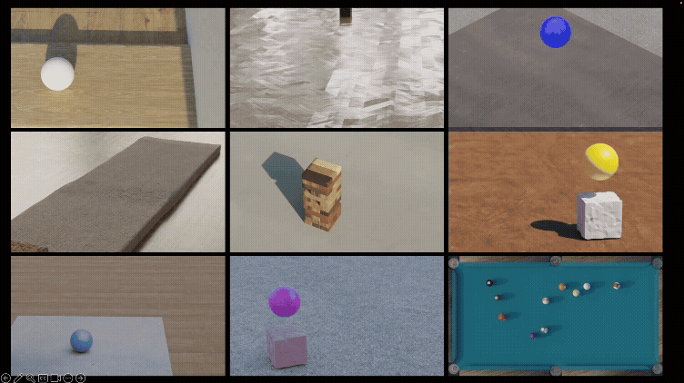

# PhyCo-Sim (Unofficial)

An **unofficial** implementation of the simulation data generation pipeline described in [**PhyCo: Learning Controllable Physical Priors for Generative Motion**](https://phyco-video.github.io/) (CVPR 2026).

> **Disclaimer.** This repository is an independent, unofficial reimplementation provided for research and educational use. It is not the official codebase associated with the paper, and it is not endorsed by or affiliated with the paper's authors or their institutions.

This pipeline generates annotated physics simulation videos with control over physical properties — friction, restitution, deformation, and applied forces. It extends [Kubric](https://github.com/google-research/kubric) with soft body simulation, force application, texture randomization, and rich per-frame metadata export.

<div align="center">
  
</div>

A companion [dataset on HuggingFace](https://huggingface.co/datasets/nnsriram97/phyco_kubric) (~27.5 GB) contains videos generated with this unofficial pipeline.

---

## Table of Contents

- [What's New Over Kubric](#whats-new-over-kubric)
- [Released Scenarios](#released-scenarios)
- [Installation](#installation)
- [Texture Assets](#texture-assets)
- [Running Simulations](#running-simulations)
- [Output Format](#output-format)
- [Project Structure](#project-structure)
- [Soft Body Guide](#soft-body-guide)
- [GPU Rendering](#gpu-rendering)
- [Citation](#citation)
- [Acknowledgements](#acknowledgements)

---

## What's New Over Kubric

[Kubric](https://github.com/google-research/kubric) was designed primarily for rigid body scenes. We extend it with:

- **Soft body simulation** — deformable objects with mass-spring and Neo-Hookean material models
- **Force application** — apply forces, torques, and impulses at any simulation frame
- **Fine-grained physics control** — friction, restitution, stiffness, force magnitude all exposed as CLI arguments
- **Texture randomization** — PBR textures (wood, concrete, brick, etc.) randomly sampled for visual diversity
- **HDRI environment lighting** — realistic ambient lighting and backgrounds
- **Rich metadata export** — per-object physics, camera parameters, forces, and per-frame states as JSON
- **Scalable execution** — multi-GPU parallel runners and SLURM orchestrator

For a detailed breakdown, see [docs/WHATS_NEW_OVER_KUBRIC.md](docs/WHATS_NEW_OVER_KUBRIC.md).

---

## Released Scenarios

Each row is one entry in the [PhyCo-Sim HuggingFace dataset](https://huggingface.co/datasets/nnsriram97/phyco_kubric).

| Scenario | Description | Varied Property | Launch Script |
|---|---|---|---|
| `ball_drop_v2` | Rigid ball falling onto a platform and bouncing | Bounciness (restitution) | `ball_drop_v2_parallel.sh` |
| `ball_drop_v3` | Multiple rigid balls (3–5) dropping simultaneously | Bounciness (restitution) | `ball_drop_v3_parallel.sh` |
| `ball_drop_soft_v4` | Deformable elastic ball falling onto a surface | Deformation stiffness | `ball_drop_soft_v4_parallel.sh` |
| `ball_wall_collision` | Ball rolling into a wall and bouncing back | Bounciness (restitution) | `ball_wall_collision_parallel.sh` |
| `cube_deform_soft_v2_noeff` | Rigid ball impacting a soft elastic cube | Deformation stiffness | `cube_deform_soft_v2_parallel.sh` |
| `friction_slide_flat_v2` | Rectangular brick sliding on a flat surface | Friction, slide direction | `friction_slide_flat_parallel.sh` |
| `friction_slide_flat_force_v3` | Brick sliding under an applied force | Force magnitude, direction | `friction_slide_flat_force_parallel.sh` |
| `jenga_force` | Force applied to a single block in a Jenga tower | Push direction | `jenga_force_parallel.sh` |
| `pool_table_force` | Force applied to a ball on a billiards table | Force, direction, friction, bounciness | `pool_table_force_parallel.sh` |

Each launcher invokes the corresponding `src/run_*.py` scenario through `src/run_parallel_*.py`, which manages a `ThreadPoolExecutor` and per-worker GPU assignment.

---

## Installation

See [docs/INSTALLATION.md](docs/INSTALLATION.md) for the full guide. Quick version, from the repo root:

```bash
bash setup_scripts/setup_kubric_no_docker.sh
```

This downloads Blender 3.4 next to the repo and installs all deps into Blender's bundled Python 3.10. Use the printed Python path as `--python_path` for every launcher.

---

## Texture Assets

Scenarios randomize ground/object PBR materials sampled from four texture categories. The textures are **not** included in this repository — download them yourself from [Poly Haven](https://polyhaven.com/textures), which is CC0-licensed and uses the exact filename convention the loaders expect.

Pick any number of assets from each Poly Haven category (more = more visual diversity):

| Category | Poly Haven page | Lives under |
|---|---|---|
| Wood | https://polyhaven.com/textures/wood | `$SIM_ASSETS_DIR/wood_textures/` |
| Concrete | https://polyhaven.com/textures/concrete | `$SIM_ASSETS_DIR/concrete_textures/` |
| Brick | https://polyhaven.com/textures/brick | `$SIM_ASSETS_DIR/brick_textures/` |
| Ground | https://polyhaven.com/textures/floor | `$SIM_ASSETS_DIR/ground_textures/` |

**Download settings:** choose **4K** resolution and the default `.zip` package — the loader looks for files matching `*_diff_4k.jpg`, `*_nor_gl_4k.exr`, `*_rough_4k.{jpg,exr}`, and `*_disp_4k.{jpg,png}`, which is exactly Poly Haven's naming convention.

**Required directory layout** — each asset's folder name **must end in `.blend`** (the loader filters on that suffix). Unzip the Poly Haven download into `<asset_name>.blend/textures/`:

```
$SIM_ASSETS_DIR/
  wood_textures/
    wood_planks_4k.blend/
      textures/
        wood_planks_diff_4k.jpg
        wood_planks_nor_gl_4k.exr
        wood_planks_rough_4k.jpg
        wood_planks_disp_4k.png
    weathered_planks_4k.blend/
      textures/
        ...
  concrete_textures/
    rough_concrete_4k.blend/
      textures/
        ...
  brick_textures/
    ...
  ground_textures/
    ...
```

If you already downloaded plain Poly Haven zips into folders like `wood_planks_4k/`, rename them with one line:

```bash
cd "$SIM_ASSETS_DIR/wood_textures"
for d in */; do mv "${d%/}" "${d%/}.blend"; done
# repeat for concrete_textures/, brick_textures/, ground_textures/
```

Then point the run scripts at the directory:

```bash
export SIM_ASSETS_DIR="$PWD/sim_assets"
```

**HDRIs** for environment lighting are fetched at runtime from `gs://kubric-public/assets/HDRI_haven/` (also Poly Haven, mirrored by the Kubric team) — no manual download needed.

**Tetrahedral soft-body meshes** are included in `objs/`; see the [Soft Body Guide](#soft-body-guide) for regenerating them.

---

## Running Simulations

Set `PYTHON_PATH` to the Blender Python printed by the setup script:

```bash
PYTHON_PATH=../blender-3.4.0-linux-x64/3.4/python/bin/python3.10
```

### Single video

Each `src/run_*.py` is self-contained:

```bash
"$PYTHON_PATH" src/run_ball_drop_v2.py --help
```

### Parallel multi-GPU

Use the per-scenario launcher:

```bash
bash scripts/launch/ball_drop_v3_parallel.sh \
  --python_path "$PYTHON_PATH" \
  --num_workers 8 \
  --num_videos 500 \
  --output_dir ./output/ball_drop_v3
```

### SLURM cluster

Wrap any launcher with the orchestrator:

```bash
bash scripts/launch/generic_slurm_orchestrator_v2.sh \
  --script scripts/launch/friction_slide_flat_force_parallel.sh \
  --total_num_videos 15000 \
  --partition gpu \
  --script_args "--python_path $PYTHON_PATH"
```

See [docs/SLURM.md](docs/SLURM.md) for orchestrator options.

---

## Output Format

Each simulation produces a directory containing:

```
output/<scenario>/<uuid>/
  rgba_00001.png          # RGB frames
  ...
  segmentation_00001.png  # Instance segmentation masks
  ...
  depth_00001.tiff        # Depth maps
  ...
  metadata.json           # Full scene metadata (see below)
  rgb_video.mp4
  segmentation_video.mp4
  depth_video.mp4
```

### Metadata JSON

```json
{
  "scene": { "resolution": [768, 432], "frame_start": 1, "frame_end": 97, "fps": 24 },
  "camera": {
    "position": [x, y, z],
    "quaternion": [w, x, y, z],
    "intrinsics": [[...], [...], [...]],
    "focal_length": 35.0
  },
  "objects": [
    {
      "asset_id": "ball",
      "position": [x, y, z],
      "mass": 1.0, "friction": 0.5, "restitution": 0.8,
      "segmentation_id": 1,
      "neo_hookean_mu": null,
      "spring_elastic_stiffness": null
    }
  ],
  "forces": [
    { "magnitude": 5.0, "direction": [fx, fy, fz],
      "application_point": [px, py, pz], "frame": 10 }
  ]
}
```

---

## Project Structure

```
vidgensim/
  src/
    run_*.py                  # 9 scenario scripts
    run_parallel_*.py         # parallel execution wrappers
    config.py                 # ScenarioConfig / DominoConfig
    kubric_utils.py           # camera, metadata, video helpers
  kubric/                     # vendored, modified Kubric framework
    kubric/core/objects.py        # + SoftBody class
    kubric/simulator/pybullet.py  # + soft body loading, force API
    kubric/renderer/blender.py    # + soft body rendering, HDRI support
  scripts/
    launch/                   # 9 scenario launchers + generic_slurm_orchestrator_v2.sh
    create_urdf_for_obj.py    # URDF generator for custom meshes
    tetgen_processor.py       # tet mesh processing for soft bodies
  objs/                       # mesh assets (OBJ, URDF, VTK)
  setup_scripts/
    setup_kubric_no_docker.sh
  docs/                       # all guides
```

---

## Soft Body Guide

Soft body simulations require **tetrahedral meshes** (`.vtk`) for PyBullet and **surface meshes** (`.obj`) for Blender rendering.

| Material model | Best for | Key parameters |
|---|---|---|
| Mass-Spring | General deformables, cloth-like | `spring_elastic_stiffness`, `spring_damping_stiffness`, `spring_bending_stiffness` |
| Neo-Hookean | Rubber, elastic | `neo_hookean_mu`, `neo_hookean_lambda`, `neo_hookean_damping` |

To regenerate tet meshes from surface OBJs, use `scripts/tetgen_processor.py`. Full details in [docs/SOFT_BODY_GUIDE.md](docs/SOFT_BODY_GUIDE.md) and the OBJ↔VTK mapping in [docs/TRI_TO_TET_MAPPING.md](docs/TRI_TO_TET_MAPPING.md).

---

## GPU Rendering

Set `KUBRIC_USE_GPU=true` (the launchers already do). Persist the Cycles kernel cache at `~/.cache/cycles/kernels` to avoid recompilation across runs. See [docs/EFFICIENT_RENDERING.md](docs/EFFICIENT_RENDERING.md) for the motion-detect frame-reuse optimization.

---

## Citation
If you find PhyCo-Sim useful in your research, please cite:
```bibtex
@inproceedings{narayanan2026phyco,
  title     = {PhyCo: Learning Controllable Physical Priors for Generative Motion},
  author    = {Narayanan, Sriram and Jiang, Ziyu and Narasimhan, Srinivasa G. and Chandraker, Manmohan},
  booktitle = {Proceedings of the IEEE/CVF Conference on Computer Vision and Pattern Recognition (CVPR)},
  year      = {2026},
  eprint    = {2604.28169},
  archivePrefix = {arXiv},
  primaryClass  = {cs.CV}
}
```

---

## Acknowledgements

This project builds on [Kubric](https://github.com/google-research/kubric) by Google Research which is released under the [Apache License 2.0](kubric/LICENSE).

---

## License

PhyCo-Sim is released under the [Creative Commons Attribution-NonCommercial 4.0 International (CC BY-NC 4.0)](https://creativecommons.org/licenses/by-nc/4.0/) license — see [LICENSE](LICENSE).

